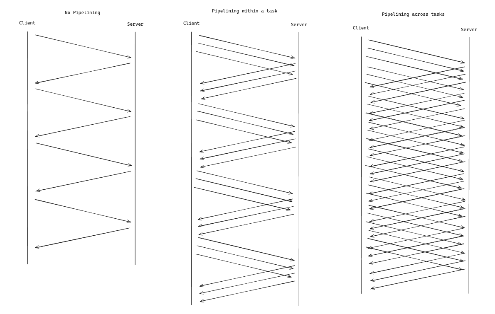
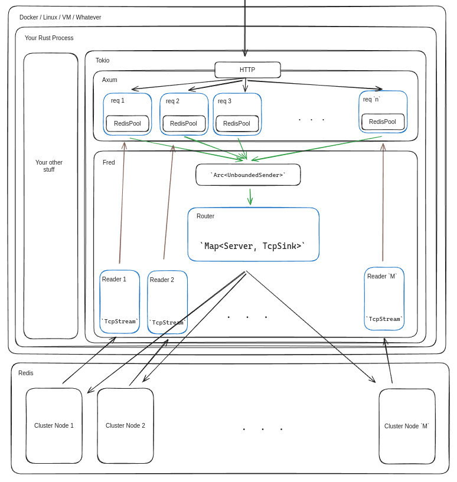

Design
======

This document provides a more detailed overview of how the library is built. The intended audience is potential
contributors, maintainers, or anybody looking to do a deeper technical evaluation.

The [CONTRIBUTING](../CONTRIBUTING.md) doc also provides a high level overview, but is written specifically for users
that want to add new commands with as little friction as possible. These documents provide more background and context.

## TLDR:

Beyond the main README, here's a quick list of things that potential users may want to consider.

* It requires Tokio.
* It does not support `no-std` builds.
* The parsing layer uses a zero-copy parser based on [bytes](https://crates.io/crates/bytes) types. If you use these
  types then the library imposes almost no additional storage overhead. For example, by using `Bytes` or `Str` as the
  primary input and output type with commands callers can avoid any additional allocations of these values. The
  response `Bytes` will be an owned view into
  the [Tokio socket buffer](https://docs.rs/tokio-util/latest/tokio_util/codec/trait.Decoder.html#tymethod.decode).
* The primary request-response happy path is lock free, nor is the caller required to use one. The client uses Tokio
  message passing features, atomics, and [crossbeam queue](https://crates.io/crates/crossbeam-queue) types as
  alternatives. This creates a nice developer experience and is pretty fast.
* The public interface is generic and supports strongly and stringly-typed usage patterns.
* There's a fallback interface for sending any command to the server.
* There's an optional lower level connection management interface.
* There are many configuration options. Arguably too many. However, I think it's worthwhile to tune most of these
  settings.

See the [benchmark](../bin/benchmark) folder for more info on performance testing.

### Background

I strongly recommend reading https://redis.io/docs/manual/pipelining. Most of the design choices here are based on the
pipelining optimization described in this section.

`fred` was originally written with the following use case in mind:

* The app layer's primary throughput bottleneck is RTT to Redis.
* The app uses different Redis server deployment types, including managed services like Elasticache.
* The app makes frequent use of Tokio concurrency features on a multi-thread runtime. Requests/jobs run in separate
  Tokio tasks.
* The app uses dependency injection patterns to share a small pool of connections/clients among each of the Tokio tasks.
  The public interface should be `Send + Sync` and cheaply cloneable.
* The app can store large values in Redis. Efficient encoding and zero-copy decoding are important.

And most importantly - making efficient use of network resources is important for the system to scale from both a cost
and performance perspective. Ideally the library could interleave frames on the wire such that concurrent request/job
tasks didn't have to wait for other tasks to receive a response from the server.

For example,

1. Task A writes command 1 to server.
2. Task B writes command 2 to server.
3. Task A reads command response 1 from server.
4. Task B reads command response 2 from server.

reduces the impact of RTT much more effectively than

1. Task A writes command 1 to server.
2. Task A reads command response 1 from server.
3. Task B writes command 2 to server.
4. Task B reads command response 2 from server.

and the effect becomes even more pronounced as concurrency (the number of tasks) increases, at least until other
bottlenecks kick in. You'll often see me describe this as "pipelining across tasks", whereas most client pipelining
interfaces control pipelining within a task.

A diagram may explain this better:



With this model we're not reducing network latency or RTT, but by rarely waiting for the server to respond we
can pack many more requests on the wire and dramatically increase throughput in high concurrency scenarios.

However, there are some interesting tradeoffs with the optimization described above, at least in Rust. At its core the
primary challenge with this strategy is that it requires not only separating write and read operations on the socket,
but it also requires operating on each half of the socket concurrently according to RESP's frame ordering rules.

### Message Passing & Queues

Another mental model that tends to work well with pipelined protocols is to think of the client as a series of queues.
For example:

1. An end user task interacts with the client by putting a message in an in-memory queue.
2. Some time later the client pops this message off the queue, serializes it, and sends it to the server over a TCP
   connection, which also effectively acts as a queue in this context. We also put the original request into another
   in-memory queue associated with the chosen connection.
3. Some time later we pop a frame off the TCP connection. Since the server always* responds to commands in order we know
   that the request at the front of the in-memory queue associated with this connection must be associated with the
   frame we just received.
4. We pop the request off the in-memory queue mentioned above and use this to respond to the caller in the original end
   user task.

This kind of approach also tends to work well in high concurrency scenarios since shared queues can be
implemented without locks (just atomics). There are several options for this, including several interfaces within Tokio.

If we think of the client as a set of queues like this then it becomes much easier to reason about how the pipelining
above should be implemented. All we really need to do is implement some policy checks in step 2 that determine whether
we should wait for step 4 to finish before processing the next command in step 2. In most cases we want to write
commands as quickly as possible, but in some cases maybe the client should wait (like `AUTH`, `HELLO`, blocking
commands, etc). Fortunately Tokio offers several ways to coordinate tasks like this.

This is why the library uses a message passing implementation. The `auto_pipeline` flag controls this optimization and
the benchmarking results show a dramatic improvement when enabled.

## Technical Overview

As mentioned above, for the most part the library uses message passing and dependency injection patterns. The primary
concern is to support highly concurrent use cases, therefore we want to minimize contention on shared resources. There
are several ways to do this, but the one used here is to utilize something like the actor model. Thankfully Tokio
provides all the underlying interfaces one would need to use basic actor model patterns without any additional
frameworks or libraries.

If you're not familiar with message passing in Rust I would strongly recommend
reading [the Tokio docs](https://docs.rs/tokio/latest/tokio/sync/index.html#message-passing) first.

Here's a top-down way to visualize the communication patterns between Tokio tasks within `fred` in the context of an
Axum app. This diagram assumes we're targeting the use case described above. Sorry for this.

* Blue boxes are Tokio tasks.
* Green arrows use a shared [MPSC channel](https://docs.rs/tokio/latest/tokio/sync/mpsc/fn.unbounded_channel.html).
* Brown arrows use [oneshot channels](https://docs.rs/tokio/latest/tokio/sync/oneshot/index.html). Callers include
  their [oneshot sender](https://docs.rs/tokio/latest/tokio/sync/oneshot/struct.Sender.html) half in any messages they
  send via the green arrows.



The shared state in this diagram is an `Arc<UnboundedSender>` that's shared between the Axum request tasks. Each of
these tasks can write to the channel without acquiring a lock, minimizing contention that could slow down the
application layer.

At a high level all the public client types are thin wrappers around an `Arc<UnboundedSender>`. A `RedisPool` is really
a `Arc<Vec<Arc<UnboundedSender>>>` with an additional atomic increment-mod-length trick in the mix. Cloning
anything `ClientLike` usually just clones one of these `Arc`s.

Generally speaking the router task sits in a `recv` loop.

```rust
async fn example(connections: &mut HashMap<Server, Connection>, rx: UnboundedReceiver<Command>) -> Result<(), RedisError> {
  while let Some(command) = rx.recv().await {
    send_to_server(connections, command).await?;
  }

  Ok(())
}
```

Commands are processed in series, but the `auto_pipeline` flag controls whether the `send_to_server` function waits on
the server to respond or not. When commands can be pipelined this way the loop can process requests as quickly as they
can be written to a socket. This model also creates a pleasant developer experience where we can pretty much ignore many
synchronization issues, and as a result it's easier to reason about how features like reconnection should work. It's
also relatively easy to implement socket flushing optimizations with this model.

However, this has some drawbacks:

* Once a command is in the `UnboundedSender` channel it's difficult to inspect or remove. There's no practical way to
  get any kind of random access into this.
* It can be difficult to preempt commands with this model. For example, forcing a reconnection should take precedence
  over a blocking command. This is more difficult to implement with this model.
* Callers should at least be aware of this channel so that they're aware of how server failure modes can lead to
  increased memory usage. This makes it perhaps surprisingly important to properly tune reconnection or backpressure
  settings, especially if memory is in short supply.
* Some things that would ideally be synchronous must instead be asynchronous. For example, I've often wanted a
  synchronous interface to inspect active connections.

As of 8.x there's a new `max_command_buffer_len` field that can be used as a circuit breaker to trigger backpressure if
this buffer grows too large.

Similarly, the reader tasks also use a `recv` loop:

```rust
async fn example(state: &mut State, stream: SplitTcpStream<Frame>) -> Result<(), RedisError> {
  while let Some(frame) = stream.try_next().await? {
    // the underlying shared buffer/queue is a crossbeam-queue `SegQueue`
    let command = state.get_oldest_command();
    // responding to oneshot channels only uses atomics and is not async, so this loop is quick
    command.respond_to_caller(frame);
  }

  Ok(())
}
```

In order for the reader task to respond to the caller in the Axum task we need a mechanism for the caller's oneshot
sender half to move between the router task and the reader task that receives the response.
An [`Arc<SegQueue>`](https://docs.rs/crossbeam-queue/latest/crossbeam_queue/struct.SegQueue.html) is shared between the
router and each reader task to support this.

## Connections

This section describes how the connection layer works.

Most connections are wrapped with a `Framed` [codec](https://docs.rs/tokio-util/latest/tokio_util/codec/index.html).
The [redis_protocol](https://github.com/aembke/redis-protocol.rs) crate includes a general
purpose [codec interface](https://docs.rs/redis-protocol/latest/redis_protocol/codec/index.html) similar to the one used
here, but without the `metrics` feature flag additions.

### Handshake

After a connection is established the client does the following:

1. Authenticate, if necessary
    1. If RESP3 - Send `HELLO 3 AUTH <username> <password>`
    2. If RESP2 - Send `AUTH <username> <password>`
    3. If no auth - Send `PING`
2. If not clustered - `SELECT` the database from the associated `RedisConfig`
3. If `auto_client_setname` then send `CLIENT SETNAME <id>`
4. Read and cache connection ID via `CLIENT ID`.
5. Read the server version via `INFO server`.
6. If clustered and not `disable_cluster_health_check` then check cluster state via `CLUSTER INFO`
7. If connecting to a replica - send `READONLY`

### Backchannel

There are several features that require or benefit from having some kind of backchannel connection to the server(s),
since the main connection used by callers could be blocked, unresponsive, or otherwise unusable. However, with clustered
deployments it would generally be wasteful to keep twice the number of connections open to each cluster
node just for these scenarios. The library tries to balance these concerns by using a single backchannel connection and
lazily moving it around the cluster as needed. There are probably some use cases where this strategy causes problems, so
it might be worth adding a new strategy via a new config option in the future.

The backchannel is used for the following scenarios:

* Sending `CLUSTER SLOTS` or `CLUSTER SHARDS`
* Sending `CLIENT UNBLOCK`
* Sending `ROLE` to check or discover replicas
* Sending `FUNCTION KILL` or `FUNCTION STATS`

Unlike connections managed by the `Router`, the backchannel connection does not use a split socket interface with a
dedicated reader task. Instead the transport is stored in an `Arc<AsyncMutex>` without automatic pipelining features,
which means it may close or become unresponsive without triggering an error until the next write attempt.

### Clustering

Cluster nodes are discovered via the function `sync_cluster` with the following process:

1. Send `CLUSTER SLOTS` on the backchannel.
    1. If the old backchannel connection is unusable, or an error occurs, then try connecting to a new node as specified
       by the `ClusterDiscoveryPolicy`. If multiple hosts are provided they are tried in series.
    2. Send `CLUSTER SLOTS` on this new connection, then cache the new connection as the new backchannel.
2. Parse the `CLUSTER SLOTS` response into a `ClusterRouting` struct.
3. Compare the new `ClusterRouting::unique_primary_nodes` output with the old connection map stored on the `Router` to
   determine which connections should be added or removed.
4. Drop the connections that no longer point to primary cluster nodes.
5. Connect to the newly discovered primary cluster nodes concurrently.
6. Split each connection and spawn reader tasks for each of the stream halves.
7. Store the new writer halves on the `Router` connection map.

The client will use this process whenever a connection closes unexpectedly or a `MOVED` error is received. In many cases
this is wrapped in a loop and delayed based on the client's `ReconnectPolicy`.

The initial cluster sync operation after a `MOVED` redirection may be delayed by `cluster_cache_update_delay`. This can
be useful with large keys that often take several milliseconds to move.

When the `Router` task receives a command it uses the command's `ClusterHash` policy
with [redis_keyslot](https://docs.rs/redis-protocol/latest/redis_protocol/fn.redis_keyslot.html) to determine the
correct cluster hash slot. This is then used with the cached `ClusterRouting::get_server` interface to map the command
to a cluster node `RedisSink`.

### Pipelining

WIP

### Transactions

WIP