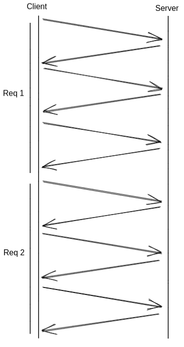
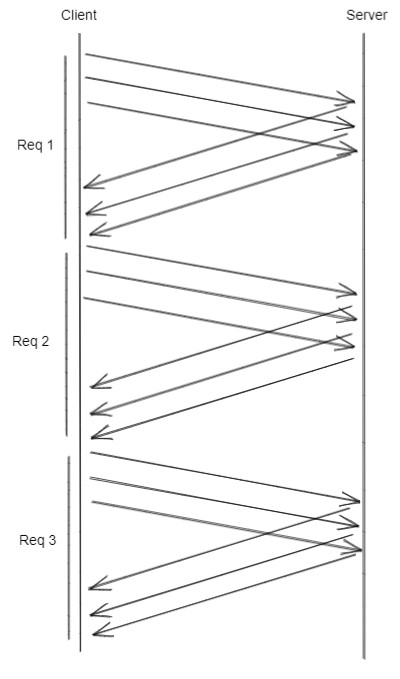
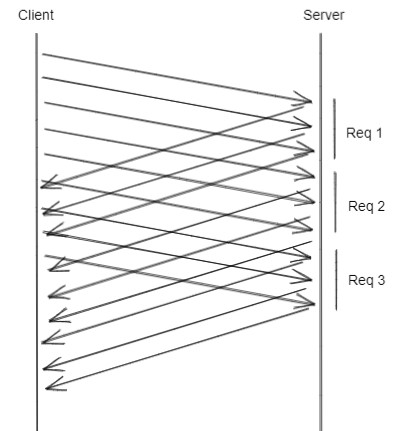

Pipelining & Transactions
=========================

There are several ways to expose a [pipelining](https://redis.io/docs/manual/pipelining/) interface in a Redis client. This document will describe the options available to callers when dealing with pipelined requests.

Fred supports three interfaces for pipelines:
1. **Disabled** - Used by setting `auto_pipeline` to `false` in the client's `PerformanceConfig`.
2. **Manual** - Can be implemented via the `pipeline` function on a `RedisClient`.
3. **Auto** - Can be enabled via the `auto_pipeline` flag on the client's `PerformanceConfig`.

Options #1 and #2 are relatively straightforward, but #3 requires some explanation. This doc will describe how exactly these interfaces work, and when callers may want to use the various interfaces.

# Example

The differences between the three pipeline interfaces are best described with a real world use case. 

The following scenario uses [axum](https://github.com/tokio-rs/axum) to implement an HTTP server. A few things to note:
* We are sharing one `RedisClient` across all requests. Every HTTP request shares the same Redis client and connection.
* A large number of requests may be processed concurrently.
* Each HTTP request uses multiple Redis commands before sending the HTTP response.
* We're hand-waving errors by using `unwrap` everywhere.
* We're hand-waving some initial server setup logic.

```rust
use axum::{
  routing::get,
  http::StatusCode,
  response::IntoResponse,
  Router,
  extract::{FromRef, FromRequestParts, State}
};
use serde::{Deserialize, Serialize};
use std::net::SocketAddr;
use fred::prelude::*;

async fn create_client() -> RedisClient {
  // will be implemented differently in each example below
  unimplemented!()
}

async fn index(State(pool): State<RedisClient>) -> Result<String, (StatusCode, String)> {
  // will be implemented differently in each example below
  unimplemented!()
}

#[tokio::main]
async fn main() {
  let client = create_client().await.unwrap();
  let app = Router::with_state(client).route("/", get(index));

  // handwave the state binding...
  
  let addr = SocketAddr::from(([127, 0, 0, 1], 3000));
  axum::Server::bind(&addr)
    .serve(app.into_make_service())
    .await
    .unwrap();
}
```

The following sections show how the network diagrams change when using the various pipeline interfaces.

## Disabled Pipelining

This example shows a client that does not use any form of pipelining. The client will wait for a response from every command before sending the next command.

```rust
async fn create_client() -> RedisClient {
  // will be implemented differently in each example below
  unimplemented!()
}
 
async fn index(State(pool): State<RedisClient>) -> Result<String, (StatusCode, String)> {
  // will be implemented differently in each example below
  unimplemented!()
}
```

Would have the following network diagram:



## Manual Pipelining

This example shows how to use manual pipelining. The series of Redis commands required to service an individual HTTP request are pipelined. 

```rust
async fn create_client() -> RedisClient {
  // will be implemented differently in each example below
  unimplemented!()
}

async fn index(State(pool): State<RedisClient>) -> Result<String, (StatusCode, String)> {
  // will be implemented differently in each example below
  unimplemented!()
}
```

Would have the following network diagram:



Note: this interface may still be useful even when `auto_pipeline` is enabled. See the [Concurrent Tasks](#Concurrent-Tasks) section for more information.

## Auto Pipelining

This example shows how to use the auto pipelining interface. Every Redis command will be pipelined across every HTTP request.

```rust
async fn create_client() -> RedisClient {
  // will be implemented differently in each example below
  unimplemented!()
}

async fn index(State(pool): State<RedisClient>) -> Result<String, (StatusCode, String)> {
  // will be implemented differently in each example below
  unimplemented!()
}
```

Would have the following network diagram:



The above diagram is not entirely accurate in all cases. In this scenario multiple HTTP request tasks are running concurrently with one shared `RedisClient`, and the Redis commands sent by each task may run in any order __across__ tasks, but the ordering will be preserved __within__ each task.

Note: Some commands are never safe to pipeline (HELLO). The client may decide to wait on a response before sending the next command in some cases.

### Examples 

Here are two examples that can illustrate how exactly this works, and how to fully utilize the `auto_pipeline` feature.

1. When a series of commands have an ordering dependency.

```rust
let first: String = client.get("foo").await?;
let second: String = client.get("bar").await?;
let third: String = client.get("baz").await?;
```

Has the following behavior:

1. Client sends `GET foo`.
2. Client receives response from `GET foo`.
3. Client sends `GET bar`.
4. Client receives response from `GET bar`.
5. Client sends `GET baz`.
6. Client receives response from `GET baz`.

Even though `auto_pipeline` is enabled the commands still wait on each other. This is due to the presence of `await` points on each command. 

However, the key difference with `auto_pipeline` enabled is that **other** tasks can interleave commands on the same connection without waiting for the commands in the above task to finish.

2. When a series of commands do not have an ordering dependency.

If callers want to take full advantage of the RTT savings with `auto_pipeline`, and a sequence of commands do not depend on one another, then the following pattern can be used: 

```rust
use futures::future::join_all;

// notice the lack of `await` points here
let first_ft = client.get("foo");
let second_ft = client.get("bar");
let third_ft = client.get("baz");

let results: Vec<String> = join_all(vec![first_ft, second_ft, third_ft]).await?;
```

Has the following behavior:

1. Client sends `GET foo`.
2. Client sends `GET bar`.
3. Client sends `GET baz`.
4. Client receives response from `GET foo`.
5. Client receives response from `GET bar`.
6. Client receives response from `GET baz`.

It's also possible to implement the same behavior with manual pipelining. However, the key difference with `auto_pipeline` is how it performs across tasks rather than within individual tasks.

# Concurrent Tasks

As mentioned above, the manual pipelining interface can still be useful even when `auto_pipeline` is enabled. 

There are some scenarios where a caller may want to ensure that a series of commands run uninterrupted without any other commands interleaved. In previous versions of Fred this was tedious and difficult to achieve when one `RedisClient` was shared across multiple tasks.

Both a `Pipeline` and `Transaction` can also be used to buffer a series of commands in memory before they're all sent to the server without interruption. Commands within a `Pipeline` or `Transaction` will never<sup>*</sup> be interrupted by another task sending a command, even when `auto_pipeline` is enabled.

\* This is not always true when running against a cluster. See the next section for more details.

# Cluster Errors

This section explains how pipelining and transactions function with cluster redirection errors. It's likely more relevant for contributors, but may be relevant for others as well. 

It is recommended that callers familiarize themselves with the [cluster redirection spec](https://redis.io/docs/reference/cluster-spec/#moved-redirection) first.

Consider the following manual `Pipeline` scenario:

```rust
let pipeline = client.pipeline();
let _ = pipeline.get("foo").await?; // returns immediately with ()
let _ = pipeline.get("bar").await?; // returns immediately with ()
let _ = pipeline.get("baz").await?; // returns immediately with ()
let results: Vec<String> = pipeline.send_all().await?;
```

If the server responds with `MOVED` or `ASK` to one or more of the commands then the client may retry them as needed. This can result in commands finishing out of order.

For example:

1. The client sends `GET foo`.
2. The client sends `GET bar`.
3. The client sends `GET baz`.
4. The server sends a successful response from `GET foo`.
5. The server sends `MOVED` or `ASK` from `GET bar`.
6. The server sends a successful response from `GET baz`.
7. The client sends `GET bar` to the correct cluster node.
8. The server sends a successful response from `GET bar`. 

In this example the client will retry `GET bar` against the correct cluster node. The `results` array **will** preserve the correct ordering of results, but the commands may run in a different order than callers expect. 

Contrast this with a more complicated `Transaction` scenario:

```rust
let trx = client.multi().await;
let _ = trx.get("foo").await?; // returns immediately with QUEUED
let _ = trx.get("bar").await?; // returns immediately with QUEUED
let results: Vec<String> = trx.exec(false).await?;
```

If the server responds with `MOVED` or `ASK` to one of the intermediate commands the transaction will call `DISCARD` and retry **the entire** transaction against the correct node.

For example:

1. The client sends `MULTI` to server `A`.
2. The server `A` sends `OK` in response to `MULTI`.
3. The client sends `GET foo` to server `A`.
4. The server `A` sends `QUEUED` in response to `GET foo`.
5. The client sends `GET bar` to server `A`.
6. The server `A` sends `MOVED` or `ASK` in response to `GET bar`.
7. The client sends `DISCARD` to server `A`.
8. The server `A` sends `OK` in response to `DISCARD`.
9. If the server sent `ASK` in step 6 - The client sends `ASKING` to server `B`.
10. If the server sent `ASK` in step 6 - The server `B` sends `OK` in response to `ASKING`.
11. The client sends `MULTI` to server `B`.
12. The server `B` sends `OK` in response to `MULTI`.
13. The client sends `GET foo` to server `B`.
14. The server `B` sends `QUEUED` in response to `GET foo`.
15. The client sends `GET bar` to server `B`.
16. The server `B` sends `QUEUED` in response to `GET bar`.
17. The client sends `EXEC` to server `B`.
18. The server `B` sends the transaction results.

The key takeaway is that a `Transaction` is not pipelined. In order to account for cluster redirection errors we must wait for each response before sending the next command. 

## TLDR

Both a `Pipeline` and `Transaction` can be used to ensure that a series of commands run without interruption from another task. However, only a `Transaction` can ensure that the commands always run in the expected order across nodes while accounting for cluster redirection errors.