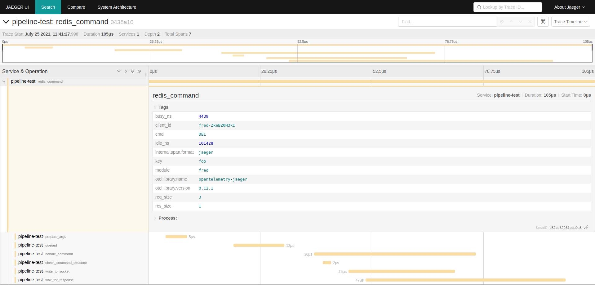

Tracing
=======

This module allows callers to enable the [tracing](https://github.com/tokio-rs/tracing) crate for tracing support. This page describes the spans used by the client and the fields emitted on each of the spans.

See the [pipeline test](../../bin/pipeline_test) test application for an example showing how to configure tracing with a local Jaeger instance. This crate ships with a [small example](../../tests/docker-compose.yml) that uses `docker-compose` to run a local Jaeger instance.

## Spans

This table shows the spans emitted by the client. The `Partial Trace` column describes whether the span will show up when only the `partial-tracing` feature flag is enabled.

| Name              | Description                                                                                                                                             | Partial Trace |
|-------------------|---------------------------------------------------------------------------------------------------------------------------------------------------------|---------------|
| redis_command     | The top level span used for all redis commands.                                                                                                         | x             |
| prepare_args      | Time spent checking and preparing arguments.                                                                                                            |               |
| queued            | Time spent waiting in the in-memory queue before being sent to the server. Pipelining and backpressure settings can drastically affect this.            |               |
| parse_pubsub      | Time spent parsing a publish-subscribe message.                                                                                                         |               |
| process_command   | Time spent for processing a command.                                                                                                                    |               |
| wait_for_response | Time spent waiting on a response from the server, starting from when the first byte is fed to the socket and ending when the response has been decoded. | x             |

Level of spans can be configured through [TracingConfig](../types/config.rs)

## Events

| Name                    | Description                                                                   |
|-------------------------|-------------------------------------------------------------------------------|
| backpressure            | Emitted when a command hits backpressure due to too many in-flight commands.  |

## Fields

| Name             | Description                                                         |
|------------------|---------------------------------------------------------------------|
| client_id        | The ID of the client instance (`client.id()`).                      |
| cmd              | The redis command name.                                             |
| req_size         | The size (in bytes) of the command's arguments.                     |
| res_size         | The size (in bytes) of the command's response.                      |
| num_args         | The number of arguments being sent to the server.                   |
| buf_len          | The length of the in-memory command queue.                          |
| pipelined        | Whether or not a command was pipelined.                             |
| flush            | Whether or not the socket was flushed while sending a command.      |
| channel          | The channel on which a pubsub message was received.                 |
| duration_ms      | The duration of a pause, in milliseconds, of a backpressure event.  |